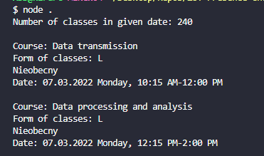

# ZUT-Presence-Checker
Simple puppeteer script written in like 40 minutes to check how many times you were absent during classes! (Because ["e-edziakant"](https://edziekanat.zut.edu.pl) doesnt have this feature ¯\\\_(ツ)\_/¯ )

  
 How does it work? - Example image 

  Thanks to that you dont have to click milions of times to check your presence!  
  Just run the script and it will list desired status of your presence in given dates.  
  Feel free to edit it to your hearts content! I set it to display only absence ("Nieobecny") because this is what I needed.  

  

